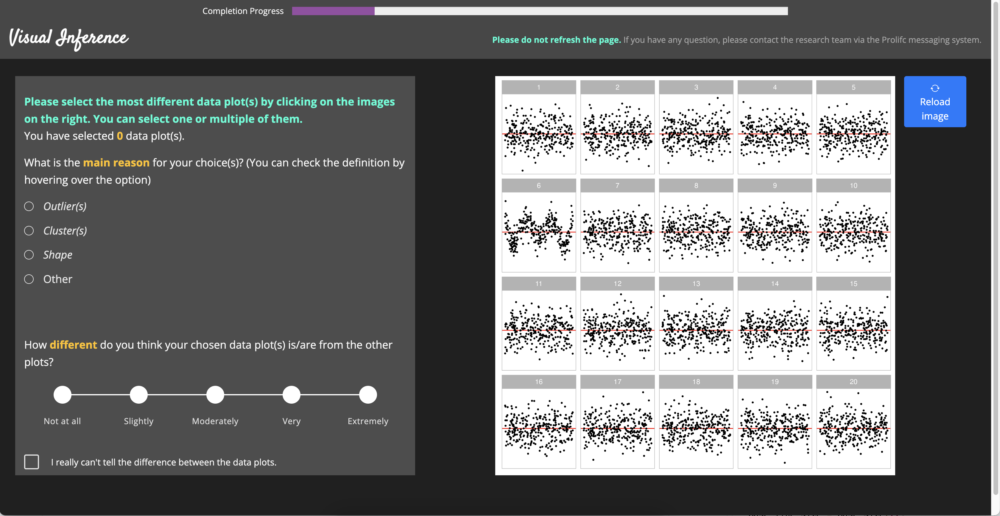
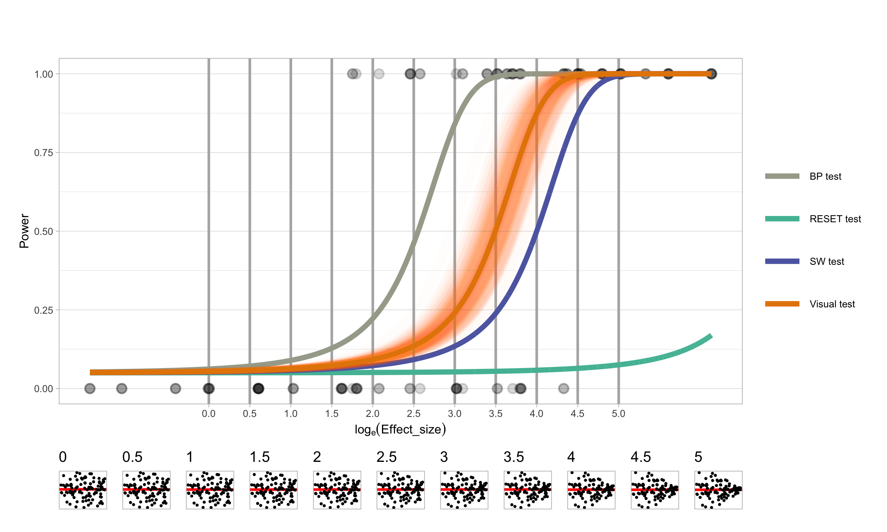

```{r setup, include=FALSE}
options(htmltools.dir.version = FALSE)
knitr::opts_chunk$set(
  fig.width=5, fig.height=5, fig.retina=3,
  out.width = "100%",
  cache = FALSE,
  echo = FALSE,
  message = FALSE, 
  warning = FALSE,
  hiline = TRUE
)
```


```{r}
set.seed(10086)
library(RefManageR)
BibOptions(check.entries = FALSE,
           bib.style = "authoryear",
           cite.style = "apa",
           style = "Bibtex",
           # max.names = 3,
           longnamesfirst = FALSE,
           hyperlink = FALSE,
           dashed = FALSE)
myBib <- ReadBib("./Visual Inference.bib", check = FALSE)
```

```{r xaringan-themer, include=FALSE, warning=FALSE}
library(xaringanthemer)
library(tidyverse)
library(visage)
style_solarized_light(
  background_color = "#FFFFFF",
  header_font_google = google_font("Josefin Sans"),
  text_font_google   = google_font("Montserrat", "300", "300i", "400i", "600"),
  code_font_google   = google_font("Fira Mono"),
  text_color = "#000000",
  text_font_size = "1.0rem",
  header_h1_font_size = "2.0rem",
  colors = c(myblue = "#006DAE", mywhite = "#FFFFFF")
)
```

.center[
# Introduction
]

### Hello, I am Patrick Li.

--

#### **Education**

- #### Bachelor of Commerce, Business Analytics, Monash University
- #### Bachelor of Commerce (Honours), Econometrics, Monash University
- #### Currently a third-year PhD student

--

#### **Hobbies**

--
- #### Stay up late coding and enjoy a warm cup of milk tea

--
- #### Refactor codebase (~~unnecessarily~~)

--
- #### ~~Overengineer~~ Design my packages

---

class: middle, center

# Advances in Artificial Intelligence for Data Visualization: Automated Reading of Residual Plots with Computer Vision

#### Supervised by Di Cook, Emi Tanaka and Susan VanderPlas

---


.pull-left[
```{r}
set.seed(10131)
mod <- heter_model(b = 0, x = rand_lognormal())
ori_dat <- mod$gen(300)

ori_dat %>%
  VI_MODEL$plot(theme = theme_light(base_size = 12)) +
  xlab("Fitted values") +
  ylab("Residuals")
```
]

.pull-right[

# Regression Diagnostics

<br>

#### When conducting **regression diagnostics**, a common practice is to plot the **residual plot**.

#### Unfortunately, **visual discoveries** can sometimes be misleading or inaccurate.

- It looks like an indication of heteroskedasticity, but the model is correctly specified.

]


---

.pull-left[

# Visual Inference


#### Visual inference (Buja, et al. 2009) is a **statistical inferential framework**.


#### A **lineup** consists of 
- #### one **data plot**, and
- #### $m − 1$ plots (**null plots**) containing data **consistent with the null hypothesis**.

#### To perform a **visual test**, observer(s) will be asked to select the **most different plot(s)** from the lineup. And we check if the data plot is identified.
 
]


.pull-right[


```{r}
set.seed(10131)
mod$gen_lineup(300, k = 20, pos = 8) %>%
  filter(null != FALSE) %>%
  bind_rows(ori_dat %>% mutate(k = 8, null = FALSE)) %>%
  VI_MODEL$plot_lineup(theme = theme_light(base_size = 12),
                       remove_grid_line = TRUE,
                       remove_axis = TRUE)
```

]

---

.center[
# Motivation
]

### However, the lineup protocol is **unsuitable for large-scale applications**
- #### High labor costs
- #### Time-consuming
- #### Usability issues for individuals with visual impairments

---

.center[
# Research questions
]

### Build an automatic visual inference system to read residual plots

#### 1. Exploring the application of visual inference in regression diagnostics and comparing it with conventional hypothesis tests.

#### 2. Designing an automated visual inference system to assess lineups of residual plots of classical normal linear regression model.

#### 3. Deploying the automatic visual inference system as an online application and publishing the relevant open-source software.

---

class: middle, center


# A Plot is Worth a Thousand Tests: Assessing Residual Diagnostics with the Lineup Protocol
#### Weihao Li, Dianne Cook, Emi Tanaka and Susan VanderPlas (2023)
(Manuscript submitted to JCGS under review)

---

#### We set up a **visual inference experiment** with 443 participants to compare **visual tests** and **conventional tests** in the context of regression diagnostics.

.image-center[

```{r out.width = "90%"}

```

]

---

### Non-linearity Patterns

.image-center[

```{r out.width = "80%"}
knitr::include_graphics("images/polypower-1.png")
```

]

---

### Heteroskedasticity Patterns

.image-center[

```{r out.width = "80%"}

```

]

---

### We found that


#### 1. Conventional residual-based statistical tests are **more sensitive to weak departures** from model assumptions than visual tests as would be evaluated by humans. 

--

#### 2. Conventional tests often reject when departures in the form of non-linearity and heteroskedasticity **are not visibly different** from null residual plots.

--

#### 3. Residual plots need to be **delivered as a lineup** to enables a **careful calibration**.

--

#### 4. Power of the conventional test are **quite sensitive** to **how the predictors are sampled**.

--

#### 5. The **direction of heteroskedasticity** appears to affect the ability to visually detect it.

---

#### More details about my PhD project can be found on my GitHub https://github.com/TengMCing and the repo to the manuscript https://github.com/TengMCing/lineup_residual_diagnostics.

.image-center[

```{r out.width = "90%"}

```

]

---

class: middle, center

# Thanks!
